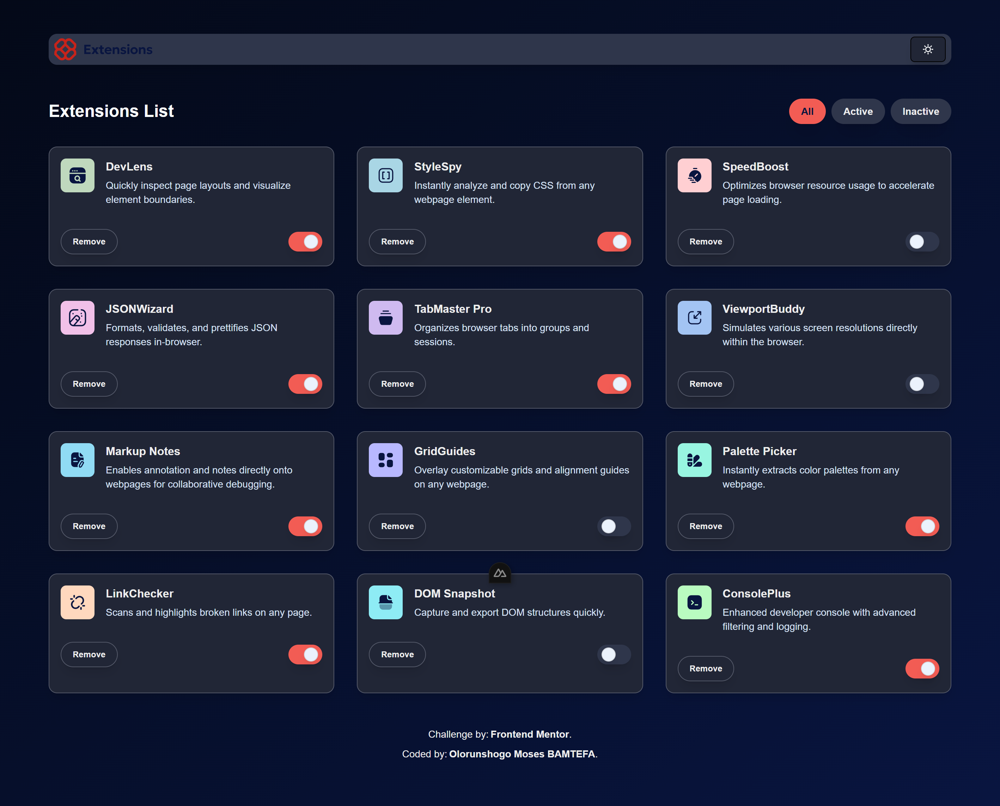
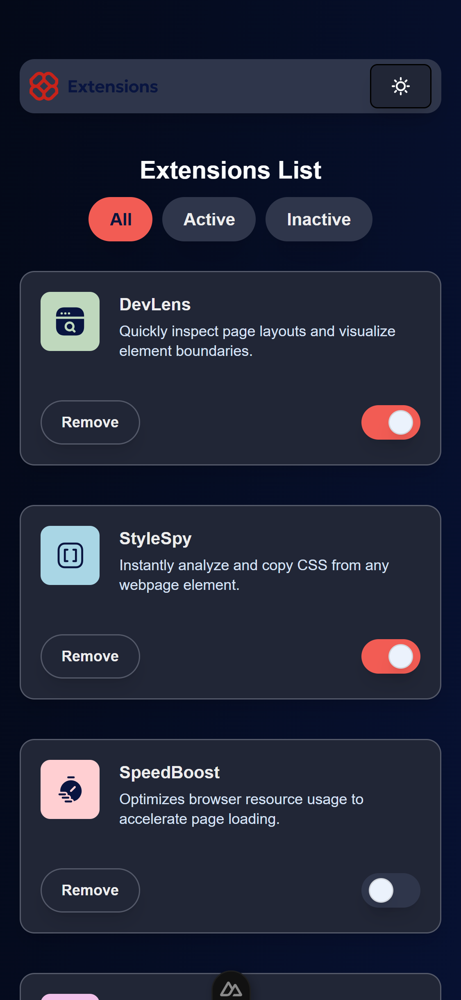

# 🚀 Browser Extensions Manager UI
A clean, intuitive, and responsive user interface for managing browser extensions. This is a solution to the [Frontend Mentor - Browser Extensions Manager UI challenge](https://www.frontendmentor.io/challenges/browser-extension-manager-ui-yNZnOfsMAp).

>Solution Url: [GitHub](https://github.com/Olorunshogo/browser-extension-manager-ui)

> View Live 👉 [Browser Extension Manager UI](https://bem-ui.vercel.app/). 

> View the challenge on 👉 [Frontend Mentor](https://www.frontendmentor.io/challenges/browser-extension-manager-ui-yNZnOfsMAp).


## 📌 Table of contents
- [🧪 The Challenge](#the-challenge)
- [📖 Overview](#overview)
- [🖼️ Screenshot](#screenshot)
- [✨ Features](#features)
- [🛠️ Tech Stack](#tech-stack)
- [🚀 Getting Started](#getting-started)
- [📁 Project Structure](#project-structure)
- [🧠 What I Learned](#what-i-learned)
- [🔮 Further Improvements](#further-improvements)
- [📣 Acknowledgments](#acknowledgments)
- [👤 Author](#author)
- [📝 License](#license)


### The challenge

Users should be able to:

- Toggle extensions between active and inactive states
- Filter active and inactive extensions
- Remove extensions from the list
- Select their color theme
- View the optimal layout for the interface depending on their device's screen size
- See hover and focus states for all interactive elements on the page


### Overview
This project replicates a browser extension manager dashboard UI. Built with ***Nuxt 4***, it emphasizes responsive design, accessibility, and a smooth user experience. It supports light/dark modes, interactive filtering, and extension state management.


### Screenshot






### Features
- ✅ Toggle extensions between **active** and **inactive** states
- 🔍 Filter by **All**, **active** or **inactive**
- ❌ Remove extensions from the list
- 🌗 Select color theme (light, dark, auto)
- 🧩 Responsive design for various screen sizes
- Accessibility features including keyboard navigation and ARIA labels
- 🔃 Smooth animations and transitions for interactive elements 
- 🖱️ Hover and focus states for all interactive elements
- 🔧 SEO optimized using useSeoMeta


### Tech Stack

- [Nuxt 4](https://nuxt.com/) - Vue framework
- [TypeScript](https://www.typescriptlang.org/) - Typed JavaScript
- [Tailwind CSS](https://tailwindcss.com/) - Utility-first CSS framework
- [Component Library:](https://ui.shadcn.com/) - For pre-built components
- [Animations](https://www.npmjs.com/package/tw-animate-css) - CSS animations
- [Icons:](https://lucide.dev/guide/packages/lucide-vue-next) - Icon library
- [Vercel](https://vercel.com/) - Deployment


### Getting started

1. **Clone the repository**

To get a local copy up and running, follow these steps.

  ```bash

    git clone https://github.com/your-username/browser-extension-manager-ui.git
    cd browser-extension-manager-ui
  ```

2. **Install dependencies**

Make sure to install dependencies:
```bash
# npm
npm install

# pnpm
pnpm install

# yarn
yarn install

# bun
bun install
```
3. **Development Server**

Start the development server on `http://localhost:3000`:

```bash
# npm
npm run dev

# pnpm
pnpm dev

# yarn
yarn dev

# bun
bun run dev
```

4. **Production**

Build the application for production:

```bash
# npm
npm run build

# pnpm
pnpm build

# yarn
yarn build

# bun
bun run build
```

Locally preview production build:

```bash
# npm
npm run preview

# pnpm
pnpm preview

# yarn
yarn preview

# bun
bun run preview
```

### Project Structure
```
pgsql

browser-extension-manager-ui/
├── app/
│   ├── components/          → Reusable Vue components
│   ├── pages/               Application pages│  
        ├── index.vue           → Main page
│   ├── assets/              → Styles, images, and other assets
│   ├── plugins/             → Nuxt plugins
│   ├── types/               → TypeScript type definitions
│   └── utils/               → Utility functions
├── .gitignore               → Git ignore file
├── public/                   → Static assets (images, icons, etc.)
├── server/                   → Server-side code (API routes)
├── nuxt.config.ts           → Nuxt configuration file
├── package.json             → Project metadata and dependencies
├── tailwind.config.js       → Tailwind CSS configuration
└── README.md                → Project documentation

```


### What I learned

- Implementing dynamic filtering with `computed()` in Vue 3.
- Leveraging watchEffect() for reactive data assignment with Nuxt's `useFetch`.
- Managing dark/light theme integration with `@nuxtjs/color-mode`.
- SEO setup using `useSeoMeta` for Open Graph and Twitter preview cards.
- Building scalable, modular, and accessible components using ShadCN's UI architecture.


### Future Improvements

- Add drag-and-drop sorting for extensions
- Implement persistence via localStorage or a backend
- Create an edit option for extension details
- Add unit and E2E tests using Vitest + Playwright
- Improve accessibility (ARIA roles and keyboard navigation)
- Optimize performance for large extension lists (e.g., virtualization)
- Add user authentication for personalized extension management
- Integrate with real browser extension APIs for live data
- Implement bulk actions (activate/deactivate/remove multiple extensions)

## Acknowledgments
- Thanks to [Frontend Mentor](https://www.frontendmentor.io/) for providing the challenge and design inspiration.
- Inspired by modern UI/UX patterns and accessibility


## Author

**Olorunshogo Moses BAMTEFA**

- Website: [Olorunshogo Moses BAMTEFA](https://shogo-portfolio-ebon.vercel.app/)
- Frontend Mentor: [@Olorunshogo](https://www.frontendmentor.io/profile/Olorunshogo)
- GitHub: [@Olorunshogo](https://www.github.com/Olorunshogo)
- X: [@Shownzy_Baba](https://x.com/Shownzy_Baba?t=xtjNwZi99l7X8Zqp4KJ4cA&s=08)


## License

This project is licensed under the MIT License. See the [LICENSE](LICENSE) file for details